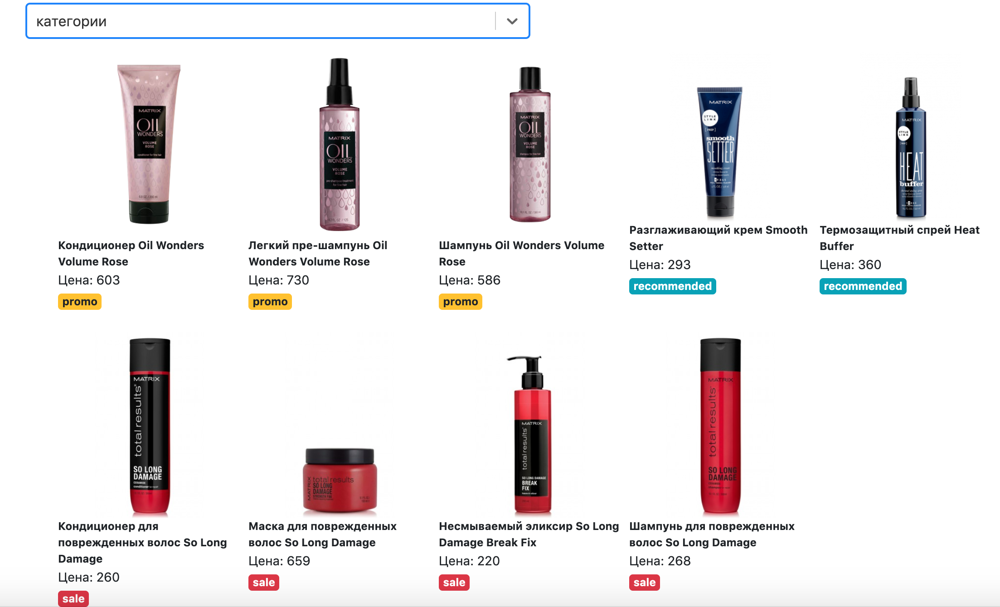

## Задача
С сервера приходит JSON с товарами. Каждый товар имеет название, картинку, цену и тип.

Товары могут быть следующих типов: скидки (sale), промо (promo) или рекомендуемые (recommended).

Необходимо получить аяксом JSON, вывести список товаров, рализовать интерфейс сортировки товаров по названию, цене, категории.

## Скрипты

Для запуска проекта:

### `npm start`

Runs the app in the development mode. 
Open [http://localhost:3000](http://localhost:3000) to view it in the browser.

